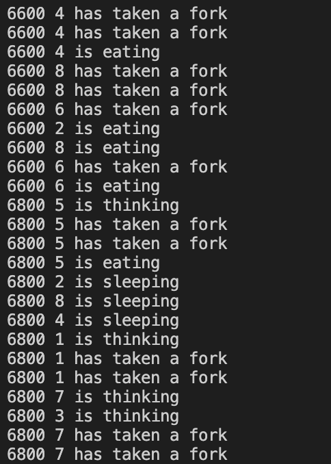

# philosopher

## 42seoul project



원탁위에서 식사하는 철학자문제<br>
https://ko.wikipedia.org/wiki/%EC%8B%9D%EC%82%AC%ED%95%98%EB%8A%94_%EC%B2%A0%ED%95%99%EC%9E%90%EB%93%A4_%EB%AC%B8%EC%A0%9C

1. /philo : Mutex를 사용, Philosophers 문제 해결
2. /philo_bonus : Semaphore 사용, Philosophers 문제 해결

<br>

## Description ; /philo;  Mutex 사용

### < 실행 >

```c
make
./philo number_of_philosophers time_to_die time_to_eat time_to_sleep
[number_of_times_each_philosopher_must_eat]		//ms단위
// ex : ./philo 4 600 200 200 [7]
```
### < 조건 >
number_of_philosophers만큼의 철학자를 생성한다.<br>
time_to_die 시간만큼 식사를 하지 못하면 죽게 된다.<br>
한 명 이상의 철학자가 죽는 순간 프로그램이 종료된다.<br>
포크는 철학자의 양옆에 1개씩 존재한다. <br>
철학자는 2개의 포크를 사용하여 식사를 하고<br>
식사를 종료하는 즉시 포크를 내려놓는다.<br>
식사직후, time_to_sleep만큼 잠을 자고,<br>
잠을 자고 나면 식사하기 전까지 생각한다.<br>
원탁위에 철학자 n명이 있고 n개의 포크가 주어진다.<br>
[number_of_times_each_philosopher_must_eat]는 종료조건이다.<br>
모든 철학자가 [number_of_times_each_philosopher_must_eat]만큼 식사를 하면 프로그램이 종료된다.<br>
### < Code >

1명의 철학자는 각 1개의 쓰레드로 구성되며 메인 쓰레드는 철학자의 정보를 관찰하게 된다.<br>
포크수만큼 Mutex 변수가 있어 포크를 동시에 집는 걸 방지한다.<br>
print나 메인쓰레드에서 철학자 쓰레드를 감시할때 mutex 를 사용하여 data race를 방지한다.<br>
<br>
<br>


## Description ; /philo_bonus;  Semaphore 사용

### < 실행 >

```c
make
./philo_bonus number_of_philosophers time_to_die time_to_eat time_to_sleep
[number_of_times_each_philosopher_must_eat]
```

### < 조건 >
위의 문제는 철학자양옆에 포크가 있는 반면에 이 문제는 원탁위에 포크가 모여있다고 가정한다.
포크가 가운데 존재하면 사용할 수 있고,
식사를 마침과 동시에 위와 동일하게 포크를 내려놓는다.
<br>

### < Code >

1명의 철학자는 각 1개의 프로세스로 구성되며<br>
메인 프로세스에 관찰자 스레드를 생성해 철학자의 정보를 관찰한다.<br>
포크 수 만큼 Semaphore를 세팅해놓는다. 포크를 집을때마다 Semaphore 정보를 바꿔준다.<br>
